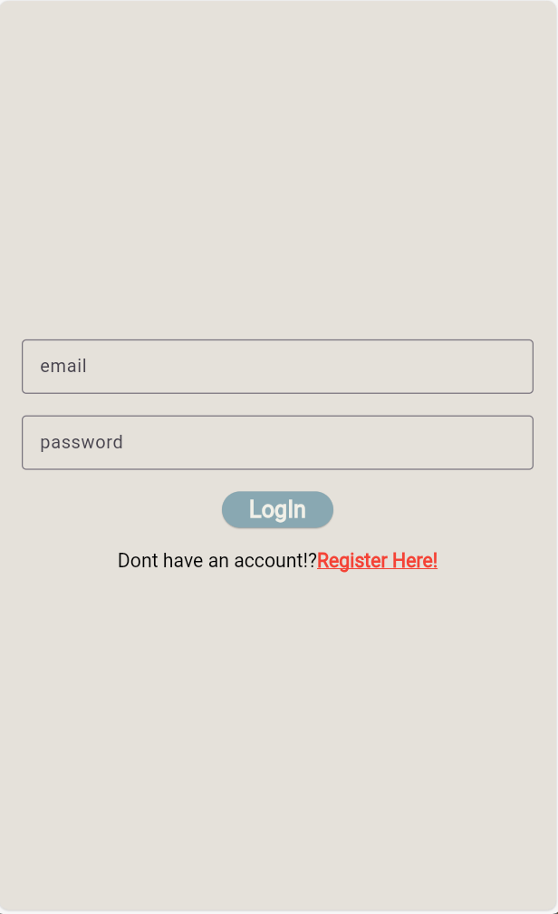
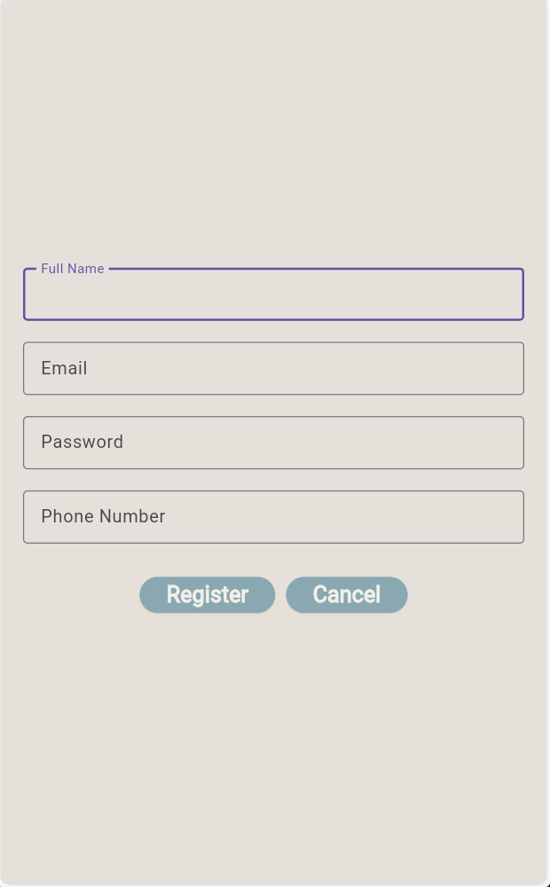
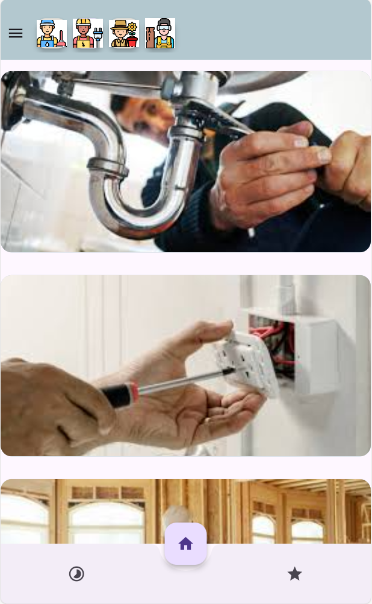
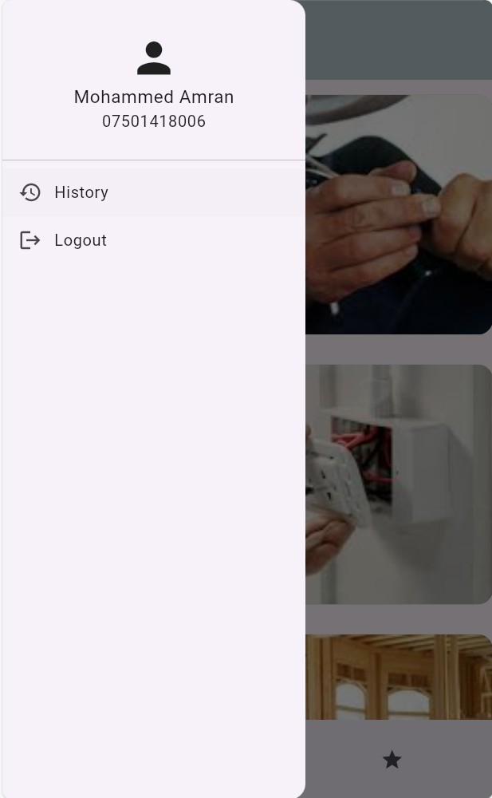
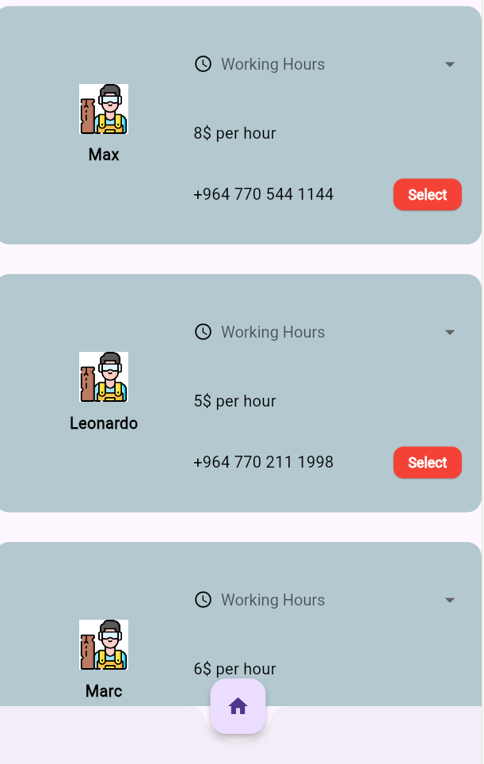
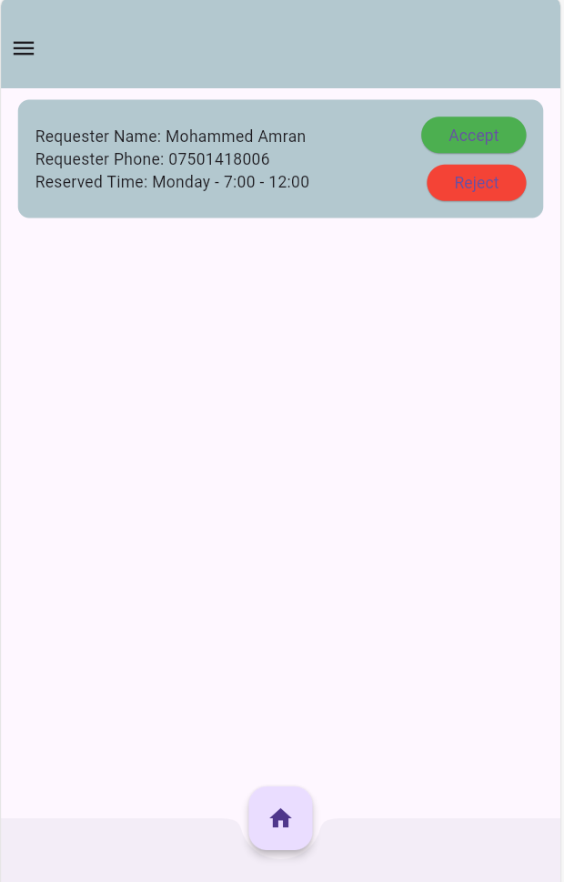
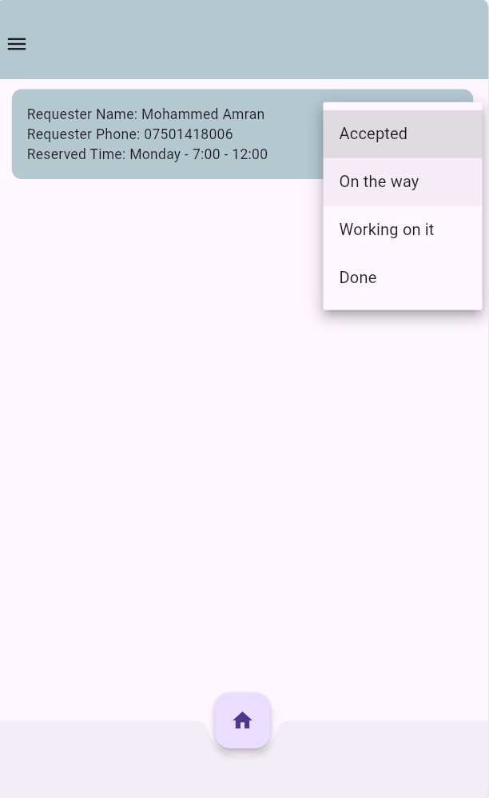
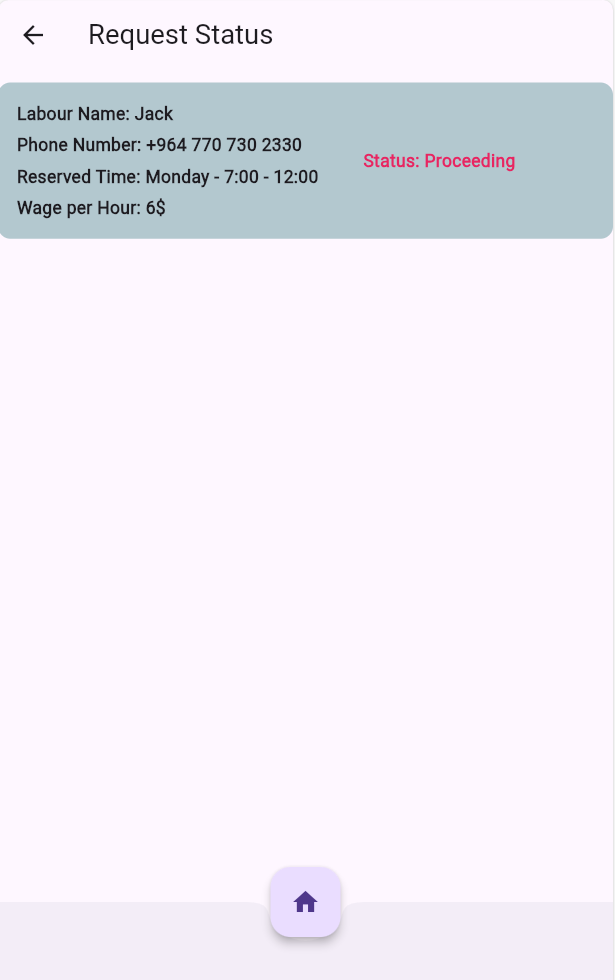

# Support For Better Living Space 🛠️🪴
A Flutter mobile app for home service technician built using Flutter and Firebase (Firestore database).

## Features
- Request a technician (as a user).
- View Request Status (as a user).
- Mark any technician as favourite (as a user).
- View all favourite technicians (as a user).
- Receive requests from users (as a technician).
- Accept/Reject received request (as a technician).
- Update accepted request status (as a technician).

## Technologies
- Flutter
- Firebase (Firestore database).

## Screenshots

## How to run the app
1. Clone the project.
2. Open the project in any IDE or Code Editor (VS Code preferred).
3. Run 'Flutter pub get' in the command line.
4. Run the project as any other flutter project on a Emulator, Physical device, or on a browser.
